# NexoZafra: Diagramas de clases por Caso de Uso (`CU01` a `CU23`)

Documentación de análisis y diseño orientada a objetos (enfoque **BCE: Boundary–Control–Entity**) alineada con el [modelo de casos de uso unificado (`CU01`–`CU23`)](casos-de-uso-v2.md) y las [especificaciones detalladas](especificaciones-casos-de-uso-v2.md).

El diagrama completo que reúne todas las clases y el mapa puro del dominio se encuentran en [diagrama-clases-completo-v2.md](diagrama-clases-completo-v2.md).

---

## Convenciones de modelado

| Tipo de clase | Estereotipo | Color | Responsabilidad |
|---|---|---|---|
| **Actor** | `<<actor>>` | Amarillo (`#FFFDE7`) | Rol humano que interactúa con la interfaz del caso de uso. |
| **Interfaz (Boundary)** | `<<interfaz>>` | Azul (`#E3F2FD`) | Pantalla o vista en React que captura entradas del usuario y presenta resultados. Sin lógica de negocio. |
| **Gestor (Control)** | `<<gestor>>` | Naranja (`#FFF3E0`) | Controlador en Python (FastAPI) o servicio que coordina validaciones, reglas de negocio y cálculos. |
| **Entidad (Entity)** | `<<entidad>>` | Verde (`#E8F5E9`) | Objeto del dominio persistido en Firestore (`Lote`, `Finca`, `LecturaPluviometro`, etc.). |
| **Sistema externo** | `<<externo>>` | Violeta (`#F3E5F5`) | API meteorológica externa (`ServicioOpenMeteo`). |

**Reglas de las relaciones:**
- El `<<actor>>` se conecta únicamente con la(s) `<<interfaz>>` que opera.
- La `<<interfaz>>` depende del `<<gestor>>` (`..> : usa`), nunca accede directo a las `<<entidad>>`.
- Un `<<gestor>>` puede coordinarse con otros `<<gestor>>` (`..>`) y opera sobre las `<<entidad>>` (`--> : gestiona / consulta`).
- Entre `<<entidad>>` se representan las asociaciones del dominio con sus multiplicidades.
- Los atributos precedidos por `/` (ej. `/duracionHoras`, `/toneladasNetasEstimadas`) son **atributos derivados**.

---

## Tabla de trazabilidad (`CU01` a `CU23`)

| Código | Caso de uso | Actor(es) | Interfaz (`<<interfaz>>`) | Gestor(es) (`<<gestor>>`) | Entidades / Externo |
|---|---|---|---|---|---|
| **CU01** | Iniciar sesión | Usuario *(abstracto)* | `InterfazLogin` | `GestorSesion` | `Usuario` |
| **CU02** | Gestionar usuarios | Administrador del sistema | `InterfazUsuarios` | `GestorUsuarios` | `Usuario`, `Finca` |
| **CU03** | Configurar parámetros de priorización | Administrador del sistema | `InterfazParametros` | `GestorParametros`, `GestorRanking` | `Parametro`, `Usuario` |
| **CU04** | Gestionar fincas y lotes | Equipo técnico agrícola | `InterfazLotes` | `GestorLotes`, `GestorParametros` | `Finca`, `Lote`, `Campaña`, `LoteCampaña`, `Pluviometro`, `Parametro` |
| **CU05** | Importar planilla de campaña | Equipo técnico agrícola | `InterfazImportacion` | `GestorImportacion`, `GestorLotes`, `GestorVariedades` | `Campaña`, `Finca`, `Lote`, `LoteCampaña`, `Variedad`, `LoteCampañaVariedad` |
| **CU06** | Gestionar variedades | Equipo técnico agrícola | `InterfazVariedades` | `GestorVariedades` | `Variedad`, `LoteCampañaVariedad`, `LoteCampaña` |
| **CU07** | Gestionar pluviómetros | Equipo técnico agrícola | `InterfazPluviometros` | `GestorPluviometros` | `Pluviometro`, `Finca`, `Lote` |
| **CU08** | Registrar lectura de pluviómetro | Jefe de lote | `InterfazLecturaPluviometro` | `GestorLecturas`, `GestorRiesgo` | `LecturaPluviometro`, `Pluviometro`, `Usuario` |
| **CU09** | Registrar estado de piso | Jefe de lote, Equipo técnico agrícola | `InterfazEstadoPiso` | `GestorEstadoPiso`, `GestorRiesgo` | `EstadoPiso`, `LoteCampaña`, `Lote`, `Usuario` |
| **CU10** | Registrar medición de Brix | Equipo técnico agrícola | `InterfazMedicionBrix` | `GestorBrix`, `GestorParametros` | `MedicionBrix`, `LoteCampaña`, `Lote`, `Parametro`, `Usuario` |
| **CU11** | Actualizar pronóstico de lluvia | Servicio de pronóstico, Equipo técnico agrícola | `InterfazPronostico` | `GestorPronostico`, `GestorRiesgo`, `GestorAlertas` | `Pronostico`, `Finca`, `Usuario`, `ServicioOpenMeteo` |
| **CU12** | Calcular riesgo de los lotes | *(Interno)* | *(sin interfaz)* | `GestorRiesgo`, `GestorLecturas`, `GestorPronostico`, `GestorParametros` | `LoteCampaña`, `Lote`, `Pluviometro`, `LecturaPluviometro`, `Pronostico`, `EstadoPiso`, `Parametro` |
| **CU13** | Consultar ranking de cosecha | Equipo técnico agrícola | `InterfazRanking` | `GestorRanking`, `GestorRiesgo`, `GestorParametros` | `Recomendacion`, `DetalleRecomendacion`, `LoteCampaña`, `Lote`, `Variedad`, `MedicionBrix`, `EstadoPiso`, `PedidoOrganico`, `Parametro`, `Usuario` |
| **CU14** | Consultar mapa de lotes | Equipo técnico agrícola | `InterfazMapa` | `GestorMapa`, `GestorLotes`, `GestorRanking` | `Lote`, `Finca`, `LoteCampaña`, `Recomendacion`, `DetalleRecomendacion`, `EstadoPiso` |
| **CU15** | Activar prioridad orgánica | Equipo técnico agrícola | `InterfazPedidoOrganico` | `GestorPedidoOrganico`, `GestorRanking` | `PedidoOrganico`, `Recomendacion`, `DetalleRecomendacion`, `Lote`, `LoteCampaña`, `Usuario` |
| **CU16** | Registrar cosecha realizada | Equipo técnico agrícola | `InterfazCosecha` | `GestorCosecha`, `GestorRanking` | `RegistroCosecha`, `LoteCampaña`, `Lote`, `Usuario` |
| **CU17** | Registrar carros en patio | Personal de báscula | `InterfazRegistroPatio` | `GestorPatio`, `GestorParametros`, `GestorAlertas` | `RegistroPatio`, `Parametro`, `Usuario` |
| **CU18** | Emitir alerta temprana a Fábrica | Fábrica *(receptor)* | `InterfazAlertas` | `GestorAlertas`, `GestorCosecha`, `GestorParametros` | `Alerta`, `Pronostico`, `RegistroPatio`, `RegistroCosecha`, `Finca`, `Parametro`, `Usuario` |
| **CU19** | Registrar parada de fábrica | Fábrica | `InterfazParadas` | `GestorParadas`, `GestorParametros`, `GestorPatio` | `ParadaFabrica`, `Parametro`, `RegistroPatio`, `Usuario` |
| **CU20** | Generar informes | Equipo técnico agrícola, Fábrica | `InterfazInformes` | `GestorInformes`, `GestorEstadoPiso`, `GestorLecturas`, `GestorParadas`, `GestorCosecha`, `GestorRanking`, `GestorAlertas` | `EstadoPiso`, `LecturaPluviometro`, `ParadaFabrica`, `RegistroCosecha`, `Recomendacion`, `Alerta` |
| **CU21** | Gestionar lotes de reserva | Equipo técnico agrícola | `InterfazLotesReserva` | `GestorReserva`, `GestorRiesgo`, `GestorParametros` | `LoteCampaña`, `Lote`, `MedicionBrix`, `EstadoPiso`, `Pronostico`, `Parametro` |
| **CU22** | Monitorear abastecimiento de patio | Equipo técnico agrícola, Fábrica | `InterfazMonitorPatio` | `GestorPatio`, `GestorCosecha`, `GestorParadas`, `GestorParametros`, `GestorAlertas` | `RegistroPatio`, `ParadaFabrica`, `RegistroCosecha`, `Lote`, `Parametro`, `Alerta` |
| **CU23** | Simular escenarios | Equipo técnico agrícola | `InterfazSimulador` | `GestorSimulador`, `GestorRiesgo`, `GestorRanking`, `GestorReserva` | `LoteCampaña`, `LecturaPluviometro`, `PedidoOrganico`, `Recomendacion`, `DetalleRecomendacion`, `RegistroPatio` |

---

## CU01 – Iniciar sesión

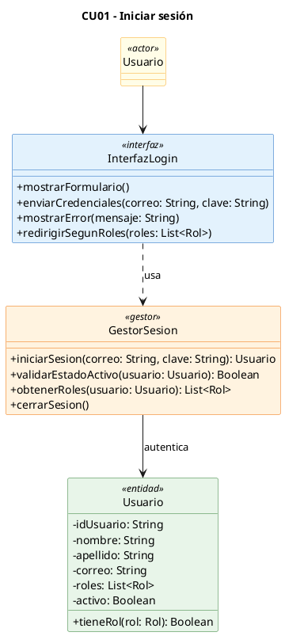
```plantuml
@startuml
title CU01 – Iniciar sesión
skinparam classAttributeIconSize 0
skinparam shadowing false
hide circle
skinparam class {
  BackgroundColor<<interfaz>> #E3F2FD
  BorderColor<<interfaz>> #1565C0
  BackgroundColor<<gestor>> #FFF3E0
  BorderColor<<gestor>> #EF6C00
  BackgroundColor<<entidad>> #E8F5E9
  BorderColor<<entidad>> #2E7D32
  BackgroundColor<<actor>> #FFFDE7
  BorderColor<<actor>> #F9A825
}

class "Usuario" as USR <<actor>>

class InterfazLogin <<interfaz>> {
  +mostrarFormulario()
  +enviarCredenciales(correo: String, clave: String)
  +mostrarError(mensaje: String)
  +redirigirSegunRoles(roles: List<Rol>)
}

class GestorSesion <<gestor>> {
  +iniciarSesion(correo: String, clave: String): Usuario
  +validarEstadoActivo(usuario: Usuario): Boolean
  +obtenerRoles(usuario: Usuario): List<Rol>
  +cerrarSesion()
}

class Usuario <<entidad>> {
  -idUsuario: String
  -nombre: String
  -apellido: String
  -correo: String
  -roles: List<Rol>
  -activo: Boolean
  +tieneRol(rol: Rol): Boolean
}

USR --> InterfazLogin
InterfazLogin ..> GestorSesion : usa
GestorSesion --> Usuario : autentica
@enduml
```

---

## CU02 – Gestionar usuarios

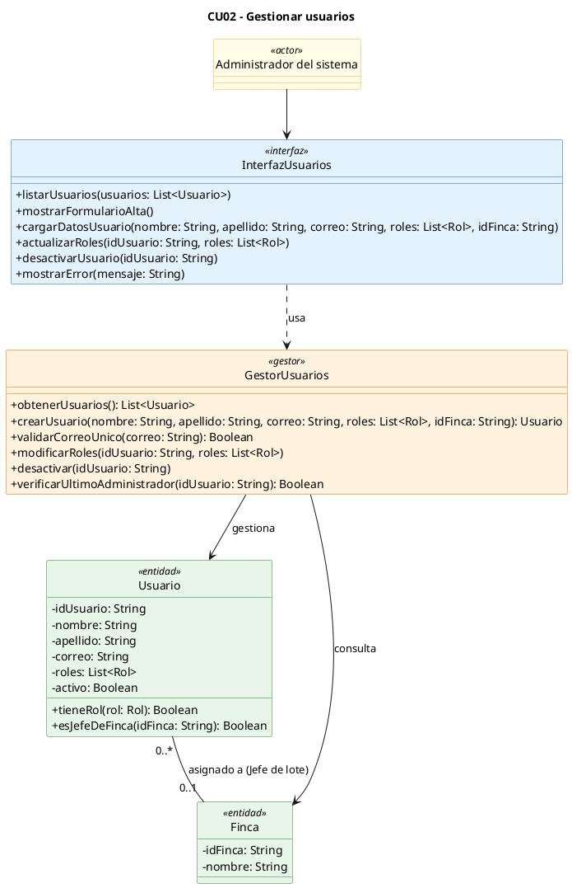
```plantuml
@startuml
title CU02 – Gestionar usuarios
skinparam classAttributeIconSize 0
skinparam shadowing false
hide circle
skinparam class {
  BackgroundColor<<interfaz>> #E3F2FD
  BorderColor<<interfaz>> #1565C0
  BackgroundColor<<gestor>> #FFF3E0
  BorderColor<<gestor>> #EF6C00
  BackgroundColor<<entidad>> #E8F5E9
  BorderColor<<entidad>> #2E7D32
  BackgroundColor<<actor>> #FFFDE7
  BorderColor<<actor>> #F9A825
}

class "Administrador del sistema" as ADM <<actor>>

class InterfazUsuarios <<interfaz>> {
  +listarUsuarios(usuarios: List<Usuario>)
  +mostrarFormularioAlta()
  +cargarDatosUsuario(nombre: String, apellido: String, correo: String, roles: List<Rol>, idFinca: String)
  +actualizarRoles(idUsuario: String, roles: List<Rol>)
  +desactivarUsuario(idUsuario: String)
  +mostrarError(mensaje: String)
}

class GestorUsuarios <<gestor>> {
  +obtenerUsuarios(): List<Usuario>
  +crearUsuario(nombre: String, apellido: String, correo: String, roles: List<Rol>, idFinca: String): Usuario
  +validarCorreoUnico(correo: String): Boolean
  +modificarRoles(idUsuario: String, roles: List<Rol>)
  +desactivar(idUsuario: String)
  +verificarUltimoAdministrador(idUsuario: String): Boolean
}

class Usuario <<entidad>> {
  -idUsuario: String
  -nombre: String
  -apellido: String
  -correo: String
  -roles: List<Rol>
  -activo: Boolean
  +tieneRol(rol: Rol): Boolean
  +esJefeDeFinca(idFinca: String): Boolean
}

class Finca <<entidad>> {
  -idFinca: String
  -nombre: String
}

ADM --> InterfazUsuarios
InterfazUsuarios ..> GestorUsuarios : usa
GestorUsuarios --> Usuario : gestiona
GestorUsuarios --> Finca : consulta
Usuario "0..*" -- "0..1" Finca : asignado a (Jefe de lote)
@enduml
```

---

## CU03 – Configurar parámetros de priorización

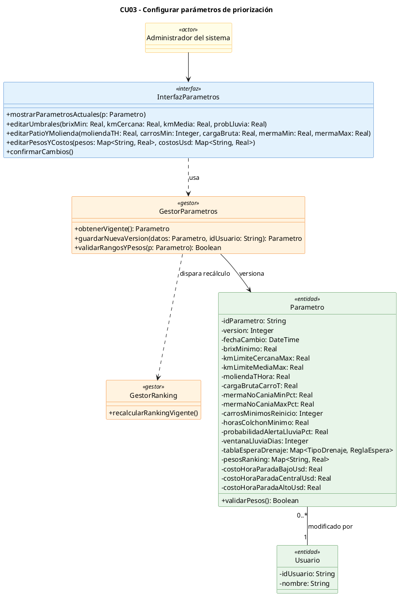
```plantuml
@startuml
title CU03 – Configurar parámetros de priorización
skinparam classAttributeIconSize 0
skinparam shadowing false
hide circle
skinparam class {
  BackgroundColor<<interfaz>> #E3F2FD
  BorderColor<<interfaz>> #1565C0
  BackgroundColor<<gestor>> #FFF3E0
  BorderColor<<gestor>> #EF6C00
  BackgroundColor<<entidad>> #E8F5E9
  BorderColor<<entidad>> #2E7D32
  BackgroundColor<<actor>> #FFFDE7
  BorderColor<<actor>> #F9A825
}

class "Administrador del sistema" as ADM <<actor>>

class InterfazParametros <<interfaz>> {
  +mostrarParametrosActuales(p: Parametro)
  +editarUmbrales(brixMin: Real, kmCercana: Real, kmMedia: Real, probLluvia: Real)
  +editarPatioYMolienda(moliendaTH: Real, carrosMin: Integer, cargaBruta: Real, mermaMin: Real, mermaMax: Real)
  +editarPesosYCostos(pesos: Map<String, Real>, costosUsd: Map<String, Real>)
  +confirmarCambios()
}

class GestorParametros <<gestor>> {
  +obtenerVigente(): Parametro
  +guardarNuevaVersion(datos: Parametro, idUsuario: String): Parametro
  +validarRangosYPesos(p: Parametro): Boolean
}

class GestorRanking <<gestor>> {
  +recalcularRankingVigente()
}

class Parametro <<entidad>> {
  -idParametro: String
  -version: Integer
  -fechaCambio: DateTime
  -brixMinimo: Real
  -kmLimiteCercanaMax: Real
  -kmLimiteMediaMax: Real
  -moliendaTHora: Real
  -cargaBrutaCarroT: Real
  -mermaNoCaniaMinPct: Real
  -mermaNoCaniaMaxPct: Real
  -carrosMinimosReinicio: Integer
  -horasColchonMinimo: Real
  -probabilidadAlertaLluviaPct: Real
  -ventanaLluviaDias: Integer
  -tablaEsperaDrenaje: Map<TipoDrenaje, ReglaEspera>
  -pesosRanking: Map<String, Real>
  -costoHoraParadaBajoUsd: Real
  -costoHoraParadaCentralUsd: Real
  -costoHoraParadaAltoUsd: Real
  +validarPesos(): Boolean
}

class Usuario <<entidad>> {
  -idUsuario: String
  -nombre: String
}

ADM --> InterfazParametros
InterfazParametros ..> GestorParametros : usa
GestorParametros ..> GestorRanking : dispara recálculo
GestorParametros --> Parametro : versiona
Parametro "0..*" -- "1" Usuario : modificado por
@enduml
```

---

## CU04 – Gestionar fincas y lotes

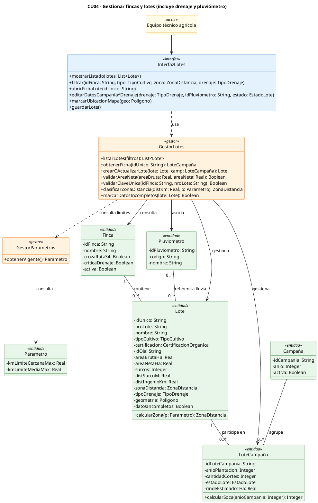
```plantuml
@startuml
title CU04 – Gestionar fincas y lotes (incluye drenaje y pluviómetro)
skinparam classAttributeIconSize 0
skinparam shadowing false
hide circle
skinparam class {
  BackgroundColor<<interfaz>> #E3F2FD
  BorderColor<<interfaz>> #1565C0
  BackgroundColor<<gestor>> #FFF3E0
  BorderColor<<gestor>> #EF6C00
  BackgroundColor<<entidad>> #E8F5E9
  BorderColor<<entidad>> #2E7D32
  BackgroundColor<<actor>> #FFFDE7
  BorderColor<<actor>> #F9A825
}

class "Equipo técnico agrícola" as ET <<actor>>

class InterfazLotes <<interfaz>> {
  +mostrarListado(lotes: List<Lote>)
  +filtrar(idFinca: String, tipo: TipoCultivo, zona: ZonaDistancia, drenaje: TipoDrenaje)
  +abrirFichaLote(idUnico: String)
  +editarDatosCampaniaYDrenaje(drenaje: TipoDrenaje, idPluviometro: String, estado: EstadoLote)
  +marcarUbicacionMapa(geo: Poligono)
  +guardarLote()
}

class GestorLotes <<gestor>> {
  +listarLotes(filtros): List<Lote>
  +obtenerFicha(idUnico: String): LoteCampaña
  +crearOActualizarLote(lote: Lote, camp: LoteCampaña): Lote
  +validarAreaNeta(areaBruta: Real, areaNeta: Real): Boolean
  +validarClaveUnica(idFinca: String, nroLote: String): Boolean
  +clasificarZonaDistancia(distKm: Real, p: Parametro): ZonaDistancia
  +marcarDatosIncompletos(lote: Lote): Boolean
}

class GestorParametros <<gestor>> {
  +obtenerVigente(): Parametro
}

class Finca <<entidad>> {
  -idFinca: String
  -nombre: String
  -cruzaRuta34: Boolean
  -criticaDrenaje: Boolean
  -activa: Boolean
}

class Lote <<entidad>> {
  -idUnico: String
  -nroLote: String
  -nombre: String
  -tipoCultivo: TipoCultivo
  -certificacion: CertificacionOrganica
  -idOia: String
  -areaBrutaHa: Real
  -areaNetaHa: Real
  -surcos: Integer
  -distSurcoM: Real
  -distIngenioKm: Real
  -zonaDistancia: ZonaDistancia
  -tipoDrenaje: TipoDrenaje
  -geometria: Poligono
  -datosIncompletos: Boolean
  +calcularZona(p: Parametro): ZonaDistancia
}

class "Campaña" as Campania <<entidad>> {
  -idCampania: String
  -anio: Integer
  -activa: Boolean
}

class "LoteCampaña" as LoteCampania <<entidad>> {
  -idLoteCampania: String
  -anioPlantacion: Integer
  -cantidadCortes: Integer
  -estadoLote: EstadoLote
  -rindeEstimadoTHa: Real
  +calcularSoca(anioCampania: Integer): Integer
}

class Pluviometro <<entidad>> {
  -idPluviometro: String
  -codigo: String
  -nombre: String
}

class Parametro <<entidad>> {
  -kmLimiteCercanaMax: Real
  -kmLimiteMediaMax: Real
}

ET --> InterfazLotes
InterfazLotes ..> GestorLotes : usa
GestorLotes ..> GestorParametros : consulta límites
GestorLotes --> Lote : gestiona
GestorLotes --> LoteCampania : gestiona
GestorLotes --> Finca : consulta
GestorLotes --> Pluviometro : asocia
GestorParametros --> Parametro : consulta

Finca "1" -- "0..*" Lote : contiene
Lote "1" -- "0..*" LoteCampania : participa en
Campania "1" -- "0..*" LoteCampania : agrupa
Pluviometro "0..1" -- "0..*" Lote : referencia lluvia
@enduml
```

---

## CU05 – Importar planilla de campaña

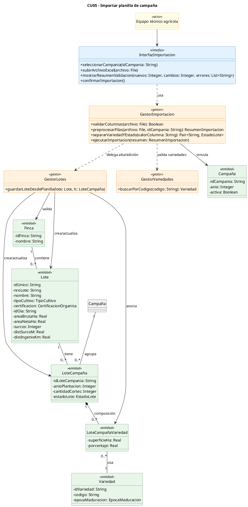
```plantuml
@startuml
title CU05 – Importar planilla de campaña
skinparam classAttributeIconSize 0
skinparam shadowing false
hide circle
skinparam class {
  BackgroundColor<<interfaz>> #E3F2FD
  BorderColor<<interfaz>> #1565C0
  BackgroundColor<<gestor>> #FFF3E0
  BorderColor<<gestor>> #EF6C00
  BackgroundColor<<entidad>> #E8F5E9
  BorderColor<<entidad>> #2E7D32
  BackgroundColor<<actor>> #FFFDE7
  BorderColor<<actor>> #F9A825
}

class "Equipo técnico agrícola" as ET <<actor>>

class InterfazImportacion <<interfaz>> {
  +seleccionarCampania(idCampania: String)
  +subirArchivoExcel(archivo: File)
  +mostrarResumenValidacion(nuevos: Integer, cambios: Integer, errores: List<String>)
  +confirmarImportacion()
}

class GestorImportacion <<gestor>> {
  +validarColumnas(archivo: File): Boolean
  +preprocesarFilas(archivo: File, idCampania: String): ResumenImportacion
  +separarVariedadYEstado(valorColumna: String): Pair<String, EstadoLote>
  +ejecutarImportacion(resumen: ResumenImportacion)
}

class GestorLotes <<gestor>> {
  +guardarLoteDesdePlanilla(lote: Lote, lc: LoteCampaña)
}

class GestorVariedades <<gestor>> {
  +buscarPorCodigo(codigo: String): Variedad
}

class "Campaña" as Campania <<entidad>> {
  -idCampania: String
  -anio: Integer
  -activa: Boolean
}

class Finca <<entidad>> {
  -idFinca: String
  -nombre: String
}

class Lote <<entidad>> {
  -idUnico: String
  -nroLote: String
  -nombre: String
  -tipoCultivo: TipoCultivo
  -certificacion: CertificacionOrganica
  -idOia: String
  -areaBrutaHa: Real
  -areaNetaHa: Real
  -surcos: Integer
  -distSurcoM: Real
  -distIngenioKm: Real
}

class "LoteCampaña" as LoteCampania <<entidad>> {
  -idLoteCampania: String
  -anioPlantacion: Integer
  -cantidadCortes: Integer
  -estadoLote: EstadoLote
}

class "LoteCampañaVariedad" as LoteCampaniaVariedad <<entidad>> {
  -superficieHa: Real
  -porcentaje: Real
}

class Variedad <<entidad>> {
  -idVariedad: String
  -codigo: String
  -epocaMaduracion: EpocaMaduracion
}

ET --> InterfazImportacion
InterfazImportacion ..> GestorImportacion : usa
GestorImportacion ..> GestorLotes : delega alta/edición
GestorImportacion ..> GestorVariedades : valida variedades
GestorImportacion --> Campania : vincula
GestorLotes --> Finca : valida
GestorLotes --> Lote : crea/actualiza
GestorLotes --> LoteCampania : crea/actualiza
GestorLotes --> LoteCampaniaVariedad : asocia

Finca "1" -- "0..*" Lote : contiene
Lote "1" -- "0..*" LoteCampania : tiene
Campaña "1" -- "0..*" LoteCampania : agrupa
LoteCampania "1" *-- "0..*" LoteCampaniaVariedad : composición
LoteCampaniaVariedad "0..*" -- "1" Variedad : usa
@enduml
```

---

## CU06 – Gestionar variedades

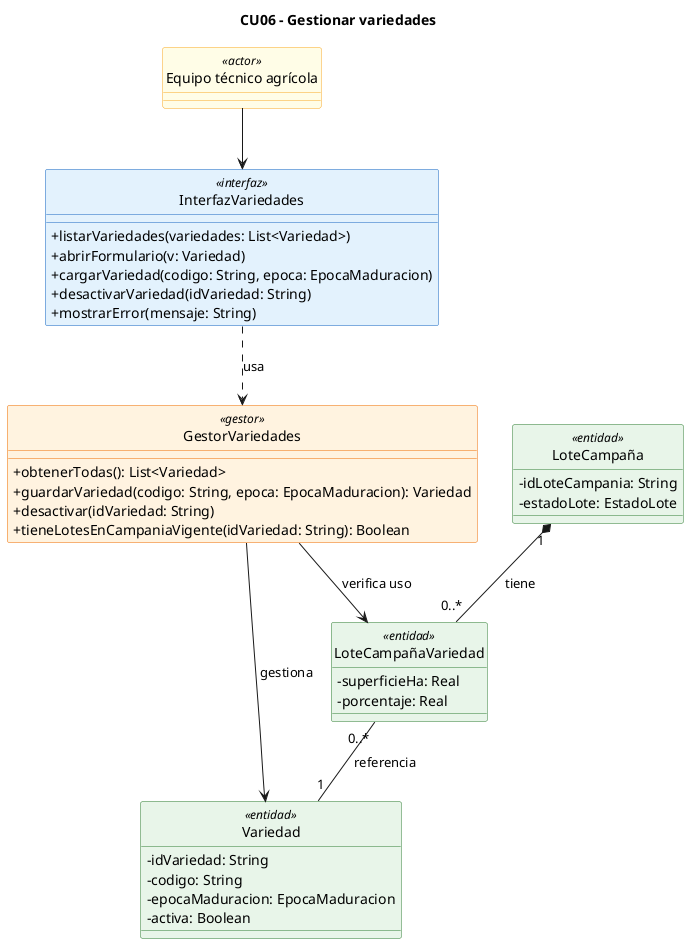
```plantuml
@startuml
title CU06 – Gestionar variedades
skinparam classAttributeIconSize 0
skinparam shadowing false
hide circle
skinparam class {
  BackgroundColor<<interfaz>> #E3F2FD
  BorderColor<<interfaz>> #1565C0
  BackgroundColor<<gestor>> #FFF3E0
  BorderColor<<gestor>> #EF6C00
  BackgroundColor<<entidad>> #E8F5E9
  BorderColor<<entidad>> #2E7D32
  BackgroundColor<<actor>> #FFFDE7
  BorderColor<<actor>> #F9A825
}

class "Equipo técnico agrícola" as ET <<actor>>

class InterfazVariedades <<interfaz>> {
  +listarVariedades(variedades: List<Variedad>)
  +abrirFormulario(v: Variedad)
  +cargarVariedad(codigo: String, epoca: EpocaMaduracion)
  +desactivarVariedad(idVariedad: String)
  +mostrarError(mensaje: String)
}

class GestorVariedades <<gestor>> {
  +obtenerTodas(): List<Variedad>
  +guardarVariedad(codigo: String, epoca: EpocaMaduracion): Variedad
  +desactivar(idVariedad: String)
  +tieneLotesEnCampaniaVigente(idVariedad: String): Boolean
}

class Variedad <<entidad>> {
  -idVariedad: String
  -codigo: String
  -epocaMaduracion: EpocaMaduracion
  -activa: Boolean
}

class "LoteCampañaVariedad" as LoteCampaniaVariedad <<entidad>> {
  -superficieHa: Real
  -porcentaje: Real
}

class "LoteCampaña" as LoteCampania <<entidad>> {
  -idLoteCampania: String
  -estadoLote: EstadoLote
}

ET --> InterfazVariedades
InterfazVariedades ..> GestorVariedades : usa
GestorVariedades --> Variedad : gestiona
GestorVariedades --> LoteCampaniaVariedad : verifica uso
LoteCampaniaVariedad "0..*" -- "1" Variedad : referencia
LoteCampania "1" *-- "0..*" LoteCampaniaVariedad : tiene
@enduml
```

---

## CU07 – Gestionar pluviómetros

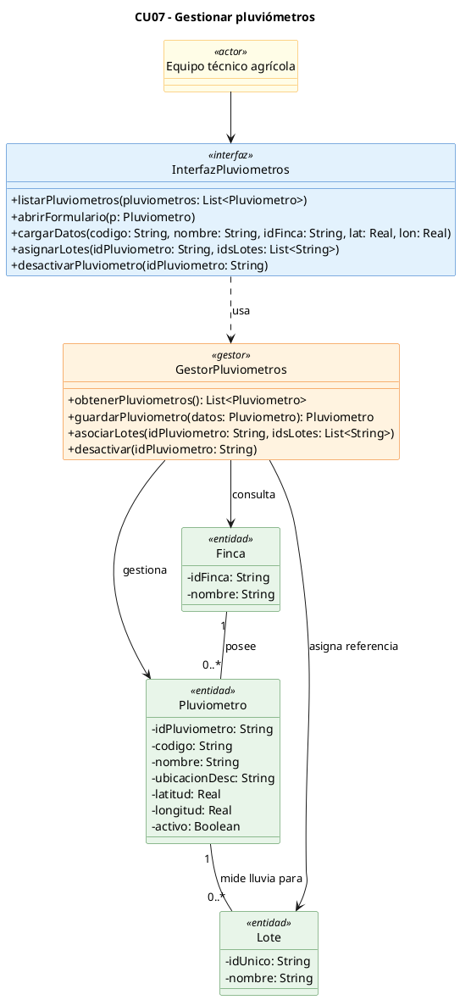
```plantuml
@startuml
title CU07 – Gestionar pluviómetros
skinparam classAttributeIconSize 0
skinparam shadowing false
hide circle
skinparam class {
  BackgroundColor<<interfaz>> #E3F2FD
  BorderColor<<interfaz>> #1565C0
  BackgroundColor<<gestor>> #FFF3E0
  BorderColor<<gestor>> #EF6C00
  BackgroundColor<<entidad>> #E8F5E9
  BorderColor<<entidad>> #2E7D32
  BackgroundColor<<actor>> #FFFDE7
  BorderColor<<actor>> #F9A825
}

class "Equipo técnico agrícola" as ET <<actor>>

class InterfazPluviometros <<interfaz>> {
  +listarPluviometros(pluviometros: List<Pluviometro>)
  +abrirFormulario(p: Pluviometro)
  +cargarDatos(codigo: String, nombre: String, idFinca: String, lat: Real, lon: Real)
  +asignarLotes(idPluviometro: String, idsLotes: List<String>)
  +desactivarPluviometro(idPluviometro: String)
}

class GestorPluviometros <<gestor>> {
  +obtenerPluviometros(): List<Pluviometro>
  +guardarPluviometro(datos: Pluviometro): Pluviometro
  +asociarLotes(idPluviometro: String, idsLotes: List<String>)
  +desactivar(idPluviometro: String)
}

class Pluviometro <<entidad>> {
  -idPluviometro: String
  -codigo: String
  -nombre: String
  -ubicacionDesc: String
  -latitud: Real
  -longitud: Real
  -activo: Boolean
}

class Finca <<entidad>> {
  -idFinca: String
  -nombre: String
}

class Lote <<entidad>> {
  -idUnico: String
  -nombre: String
}

ET --> InterfazPluviometros
InterfazPluviometros ..> GestorPluviometros : usa
GestorPluviometros --> Pluviometro : gestiona
GestorPluviometros --> Finca : consulta
GestorPluviometros --> Lote : asigna referencia
Finca "1" -- "0..*" Pluviometro : posee
Pluviometro "1" -- "0..*" Lote : mide lluvia para
@enduml
```

---

## CU08 – Registrar lectura de pluviómetro

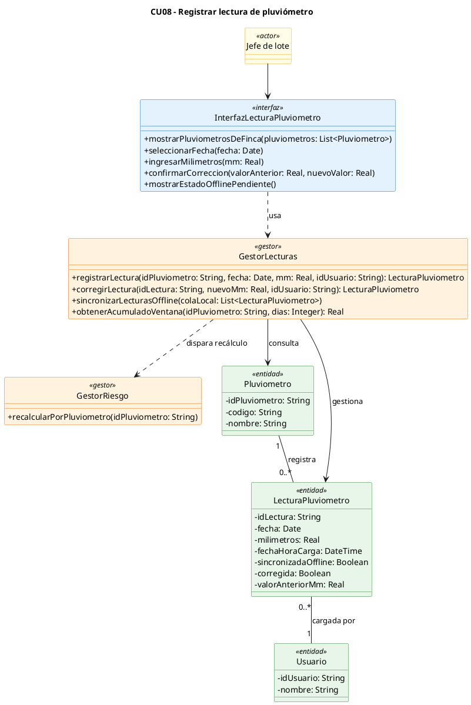
```plantuml
@startuml
title CU08 – Registrar lectura de pluviómetro
skinparam classAttributeIconSize 0
skinparam shadowing false
hide circle
skinparam class {
  BackgroundColor<<interfaz>> #E3F2FD
  BorderColor<<interfaz>> #1565C0
  BackgroundColor<<gestor>> #FFF3E0
  BorderColor<<gestor>> #EF6C00
  BackgroundColor<<entidad>> #E8F5E9
  BorderColor<<entidad>> #2E7D32
  BackgroundColor<<actor>> #FFFDE7
  BorderColor<<actor>> #F9A825
}

class "Jefe de lote" as JL <<actor>>

class InterfazLecturaPluviometro <<interfaz>> {
  +mostrarPluviometrosDeFinca(pluviometros: List<Pluviometro>)
  +seleccionarFecha(fecha: Date)
  +ingresarMilimetros(mm: Real)
  +confirmarCorreccion(valorAnterior: Real, nuevoValor: Real)
  +mostrarEstadoOfflinePendiente()
}

class GestorLecturas <<gestor>> {
  +registrarLectura(idPluviometro: String, fecha: Date, mm: Real, idUsuario: String): LecturaPluviometro
  +corregirLectura(idLectura: String, nuevoMm: Real, idUsuario: String): LecturaPluviometro
  +sincronizarLecturasOffline(colaLocal: List<LecturaPluviometro>)
  +obtenerAcumuladoVentana(idPluviometro: String, dias: Integer): Real
}

class GestorRiesgo <<gestor>> {
  +recalcularPorPluviometro(idPluviometro: String)
}

class Pluviometro <<entidad>> {
  -idPluviometro: String
  -codigo: String
  -nombre: String
}

class LecturaPluviometro <<entidad>> {
  -idLectura: String
  -fecha: Date
  -milimetros: Real
  -fechaHoraCarga: DateTime
  -sincronizadaOffline: Boolean
  -corregida: Boolean
  -valorAnteriorMm: Real
}

class Usuario <<entidad>> {
  -idUsuario: String
  -nombre: String
}

JL --> InterfazLecturaPluviometro
InterfazLecturaPluviometro ..> GestorLecturas : usa
GestorLecturas ..> GestorRiesgo : dispara recálculo
GestorLecturas --> LecturaPluviometro : gestiona
GestorLecturas --> Pluviometro : consulta
Pluviometro "1" -- "0..*" LecturaPluviometro : registra
LecturaPluviometro "0..*" -- "1" Usuario : cargada por
@enduml
```

---

## CU09 – Registrar estado de piso

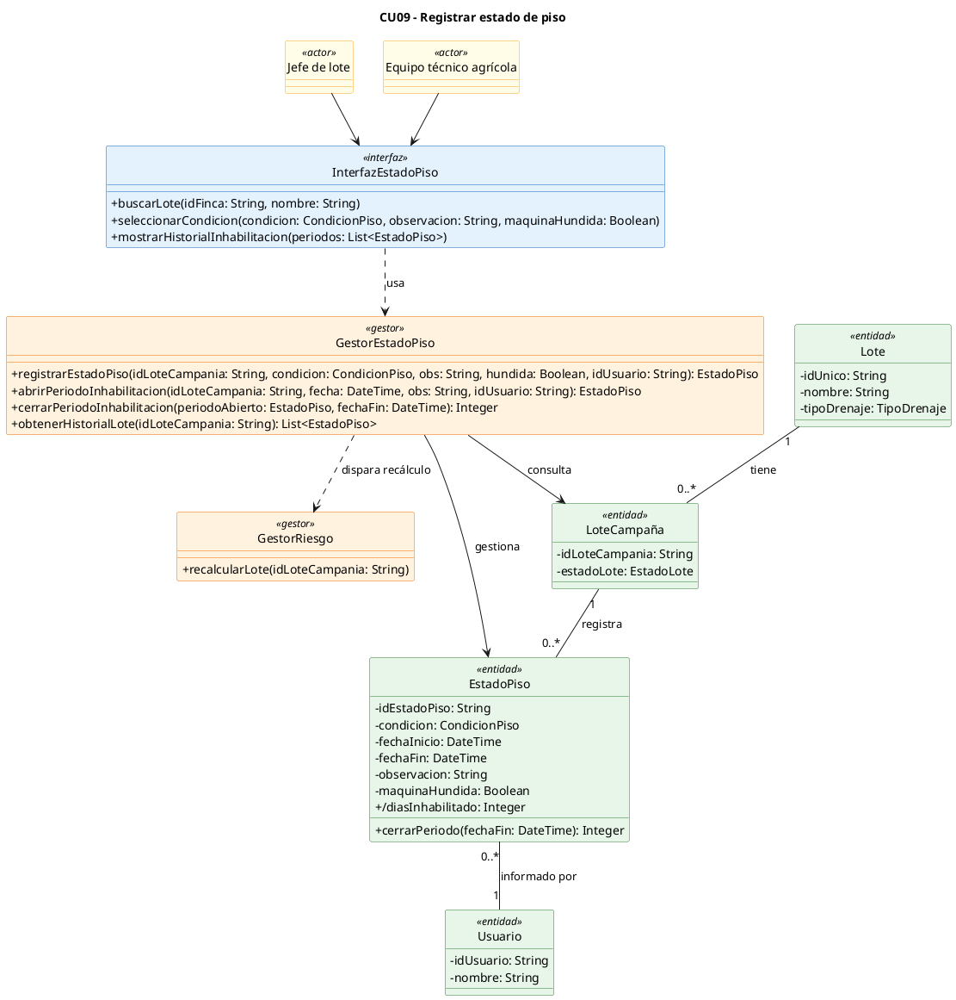
```plantuml
@startuml
title CU09 – Registrar estado de piso
skinparam classAttributeIconSize 0
skinparam shadowing false
hide circle
skinparam class {
  BackgroundColor<<interfaz>> #E3F2FD
  BorderColor<<interfaz>> #1565C0
  BackgroundColor<<gestor>> #FFF3E0
  BorderColor<<gestor>> #EF6C00
  BackgroundColor<<entidad>> #E8F5E9
  BorderColor<<entidad>> #2E7D32
  BackgroundColor<<actor>> #FFFDE7
  BorderColor<<actor>> #F9A825
}

class "Jefe de lote" as JL <<actor>>
class "Equipo técnico agrícola" as ET <<actor>>

class InterfazEstadoPiso <<interfaz>> {
  +buscarLote(idFinca: String, nombre: String)
  +seleccionarCondicion(condicion: CondicionPiso, observacion: String, maquinaHundida: Boolean)
  +mostrarHistorialInhabilitacion(periodos: List<EstadoPiso>)
}

class GestorEstadoPiso <<gestor>> {
  +registrarEstadoPiso(idLoteCampania: String, condicion: CondicionPiso, obs: String, hundida: Boolean, idUsuario: String): EstadoPiso
  +abrirPeriodoInhabilitacion(idLoteCampania: String, fecha: DateTime, obs: String, idUsuario: String): EstadoPiso
  +cerrarPeriodoInhabilitacion(periodoAbierto: EstadoPiso, fechaFin: DateTime): Integer
  +obtenerHistorialLote(idLoteCampania: String): List<EstadoPiso>
}

class GestorRiesgo <<gestor>> {
  +recalcularLote(idLoteCampania: String)
}

class Lote <<entidad>> {
  -idUnico: String
  -nombre: String
  -tipoDrenaje: TipoDrenaje
}

class "LoteCampaña" as LoteCampania <<entidad>> {
  -idLoteCampania: String
  -estadoLote: EstadoLote
}

class EstadoPiso <<entidad>> {
  -idEstadoPiso: String
  -condicion: CondicionPiso
  -fechaInicio: DateTime
  -fechaFin: DateTime
  -observacion: String
  -maquinaHundida: Boolean
  +/diasInhabilitado: Integer
  +cerrarPeriodo(fechaFin: DateTime): Integer
}

class Usuario <<entidad>> {
  -idUsuario: String
  -nombre: String
}

JL --> InterfazEstadoPiso
ET --> InterfazEstadoPiso
InterfazEstadoPiso ..> GestorEstadoPiso : usa
GestorEstadoPiso ..> GestorRiesgo : dispara recálculo
GestorEstadoPiso --> EstadoPiso : gestiona
GestorEstadoPiso --> LoteCampania : consulta
Lote "1" -- "0..*" LoteCampania : tiene
LoteCampania "1" -- "0..*" EstadoPiso : registra
EstadoPiso "0..*" -- "1" Usuario : informado por
@enduml
```

---

## CU10 – Registrar medición de Brix

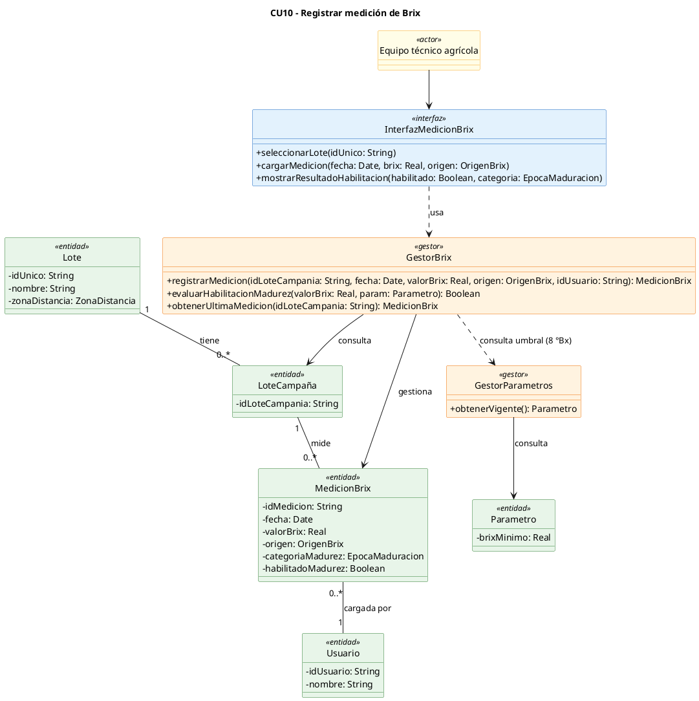
```plantuml
@startuml
title CU10 – Registrar medición de Brix
skinparam classAttributeIconSize 0
skinparam shadowing false
hide circle
skinparam class {
  BackgroundColor<<interfaz>> #E3F2FD
  BorderColor<<interfaz>> #1565C0
  BackgroundColor<<gestor>> #FFF3E0
  BorderColor<<gestor>> #EF6C00
  BackgroundColor<<entidad>> #E8F5E9
  BorderColor<<entidad>> #2E7D32
  BackgroundColor<<actor>> #FFFDE7
  BorderColor<<actor>> #F9A825
}

class "Equipo técnico agrícola" as ET <<actor>>

class InterfazMedicionBrix <<interfaz>> {
  +seleccionarLote(idUnico: String)
  +cargarMedicion(fecha: Date, brix: Real, origen: OrigenBrix)
  +mostrarResultadoHabilitacion(habilitado: Boolean, categoria: EpocaMaduracion)
}

class GestorBrix <<gestor>> {
  +registrarMedicion(idLoteCampania: String, fecha: Date, valorBrix: Real, origen: OrigenBrix, idUsuario: String): MedicionBrix
  +evaluarHabilitacionMadurez(valorBrix: Real, param: Parametro): Boolean
  +obtenerUltimaMedicion(idLoteCampania: String): MedicionBrix
}

class GestorParametros <<gestor>> {
  +obtenerVigente(): Parametro
}

class Lote <<entidad>> {
  -idUnico: String
  -nombre: String
  -zonaDistancia: ZonaDistancia
}

class "LoteCampaña" as LoteCampania <<entidad>> {
  -idLoteCampania: String
}

class MedicionBrix <<entidad>> {
  -idMedicion: String
  -fecha: Date
  -valorBrix: Real
  -origen: OrigenBrix
  -categoriaMadurez: EpocaMaduracion
  -habilitadoMadurez: Boolean
}

class Parametro <<entidad>> {
  -brixMinimo: Real
}

class Usuario <<entidad>> {
  -idUsuario: String
  -nombre: String
}

ET --> InterfazMedicionBrix
InterfazMedicionBrix ..> GestorBrix : usa
GestorBrix ..> GestorParametros : consulta umbral (8 °Bx)
GestorBrix --> MedicionBrix : gestiona
GestorBrix --> LoteCampania : consulta
GestorParametros --> Parametro : consulta
Lote "1" -- "0..*" LoteCampania : tiene
LoteCampania "1" -- "0..*" MedicionBrix : mide
MedicionBrix "0..*" -- "1" Usuario : cargada por
@enduml
```

---

## CU11 – Actualizar pronóstico de lluvia

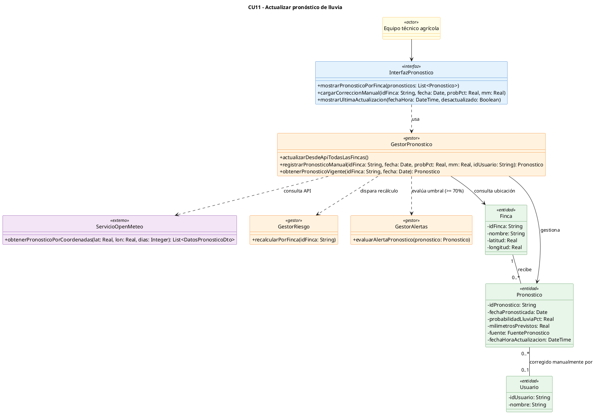
```plantuml
@startuml
title CU11 – Actualizar pronóstico de lluvia
skinparam classAttributeIconSize 0
skinparam shadowing false
hide circle
skinparam class {
  BackgroundColor<<interfaz>> #E3F2FD
  BorderColor<<interfaz>> #1565C0
  BackgroundColor<<gestor>> #FFF3E0
  BorderColor<<gestor>> #EF6C00
  BackgroundColor<<entidad>> #E8F5E9
  BorderColor<<entidad>> #2E7D32
  BackgroundColor<<externo>> #F3E5F5
  BorderColor<<externo>> #6A1B9A
  BackgroundColor<<actor>> #FFFDE7
  BorderColor<<actor>> #F9A825
}

class "Equipo técnico agrícola" as ET <<actor>>
class ServicioOpenMeteo <<externo>> {
  +obtenerPronosticoPorCoordenadas(lat: Real, lon: Real, dias: Integer): List<DatosPronosticoDto>
}

class InterfazPronostico <<interfaz>> {
  +mostrarPronosticoPorFinca(pronosticos: List<Pronostico>)
  +cargarCorreccionManual(idFinca: String, fecha: Date, probPct: Real, mm: Real)
  +mostrarUltimaActualizacion(fechaHora: DateTime, desactualizado: Boolean)
}

class GestorPronostico <<gestor>> {
  +actualizarDesdeApiTodasLasFincas()
  +registrarPronosticoManual(idFinca: String, fecha: Date, probPct: Real, mm: Real, idUsuario: String): Pronostico
  +obtenerPronosticoVigente(idFinca: String, fecha: Date): Pronostico
}

class GestorRiesgo <<gestor>> {
  +recalcularPorFinca(idFinca: String)
}

class GestorAlertas <<gestor>> {
  +evaluarAlertaPronostico(pronostico: Pronostico)
}

class Finca <<entidad>> {
  -idFinca: String
  -nombre: String
  -latitud: Real
  -longitud: Real
}

class Pronostico <<entidad>> {
  -idPronostico: String
  -fechaPronosticada: Date
  -probabilidadLluviaPct: Real
  -milimetrosPrevistos: Real
  -fuente: FuentePronostico
  -fechaHoraActualizacion: DateTime
}

class Usuario <<entidad>> {
  -idUsuario: String
  -nombre: String
}

ET --> InterfazPronostico
InterfazPronostico ..> GestorPronostico : usa
GestorPronostico ..> ServicioOpenMeteo : consulta API
GestorPronostico ..> GestorRiesgo : dispara recálculo
GestorPronostico ..> GestorAlertas : evalúa umbral (>= 70%)
GestorPronostico --> Pronostico : gestiona
GestorPronostico --> Finca : consulta ubicación
Finca "1" -- "0..*" Pronostico : recibe
Pronostico "0..*" -- "0..1" Usuario : corregido manualmente por
@enduml
```

---

## CU12 – Calcular riesgo de los lotes (caso interno)

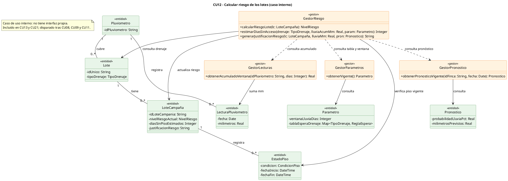
```plantuml
@startuml
title CU12 – Calcular riesgo de los lotes (caso interno)
skinparam classAttributeIconSize 0
skinparam shadowing false
hide circle
skinparam class {
  BackgroundColor<<gestor>> #FFF3E0
  BorderColor<<gestor>> #EF6C00
  BackgroundColor<<entidad>> #E8F5E9
  BorderColor<<entidad>> #2E7D32
}

note as N1
  Caso de uso interno: no tiene interfaz propia.
  Incluido en CU13 y CU21; disparado tras CU08, CU09 y CU11.
end note

class GestorRiesgo <<gestor>> {
  +calcularRiesgoLote(lc: LoteCampaña): NivelRiesgo
  +estimarDiasSinAcceso(drenaje: TipoDrenaje, lluviaAcumMm: Real, param: Parametro): Integer
  +generarJustificacionRiesgo(lc: LoteCampaña, lluviaMm: Real, pron: Pronostico): String
}

class GestorLecturas <<gestor>> {
  +obtenerAcumuladoVentana(idPluviometro: String, dias: Integer): Real
}

class GestorPronostico <<gestor>> {
  +obtenerPronosticoVigente(idFinca: String, fecha: Date): Pronostico
}

class GestorParametros <<gestor>> {
  +obtenerVigente(): Parametro
}

class Lote <<entidad>> {
  -idUnico: String
  -tipoDrenaje: TipoDrenaje
}

class "LoteCampaña" as LoteCampania <<entidad>> {
  -idLoteCampania: String
  -nivelRiesgoActual: NivelRiesgo
  -diasSinPisoEstimados: Integer
  -justificacionRiesgo: String
}

class Pluviometro <<entidad>> {
  -idPluviometro: String
}

class LecturaPluviometro <<entidad>> {
  -fecha: Date
  -milimetros: Real
}

class Pronostico <<entidad>> {
  -probabilidadLluviaPct: Real
  -milimetrosPrevistos: Real
}

class EstadoPiso <<entidad>> {
  -condicion: CondicionPiso
  -fechaInicio: DateTime
  -fechaFin: DateTime
}

class Parametro <<entidad>> {
  -ventanaLluviaDias: Integer
  -tablaEsperaDrenaje: Map<TipoDrenaje, ReglaEspera>
}

GestorRiesgo ..> GestorLecturas : consulta acumulado
GestorRiesgo ..> GestorPronostico : consulta pronóstico
GestorRiesgo ..> GestorParametros : consulta tabla y ventana

GestorRiesgo --> LoteCampania : actualiza riesgo
GestorRiesgo --> Lote : consulta drenaje
GestorRiesgo --> EstadoPiso : verifica piso vigente
GestorLecturas --> LecturaPluviometro : suma mm
GestorPronostico --> Pronostico : consulta
GestorParametros --> Parametro : consulta

Lote "1" -- "0..*" LoteCampania : tiene
Pluviometro "1" -- "0..*" Lote : cubre
Pluviometro "1" -- "0..*" LecturaPluviometro : registra
LoteCampania "1" -- "0..*" EstadoPiso : registra
@enduml
```

---

## CU13 – Consultar ranking de cosecha

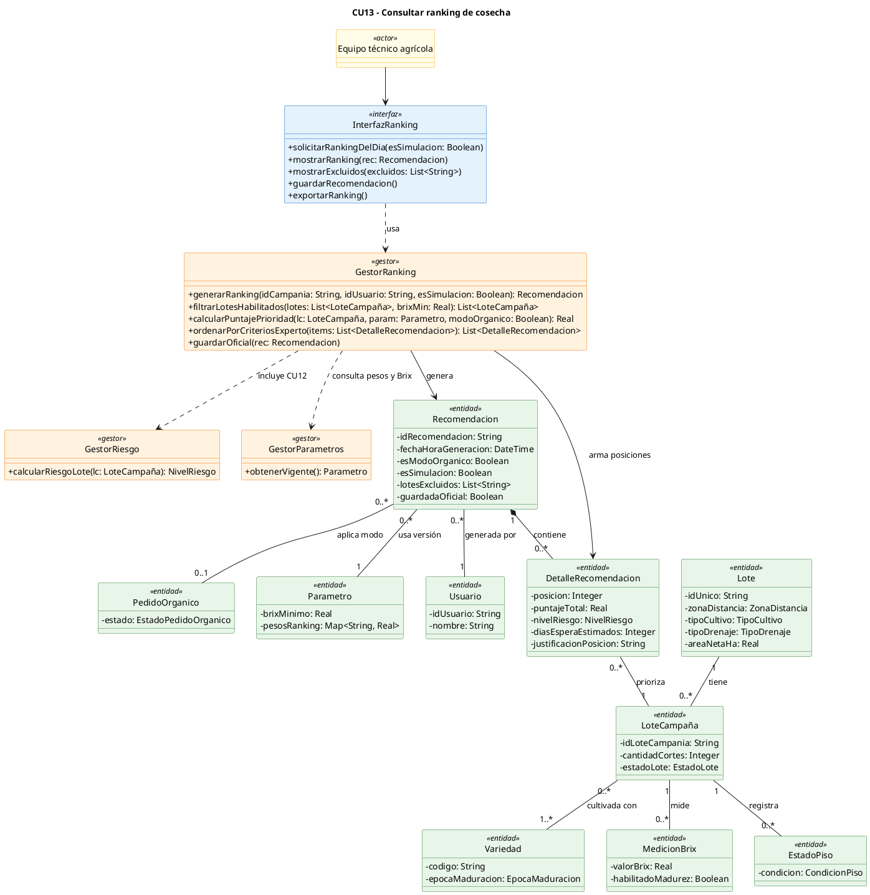
```plantuml
@startuml
title CU13 – Consultar ranking de cosecha
skinparam classAttributeIconSize 0
skinparam shadowing false
hide circle
skinparam class {
  BackgroundColor<<interfaz>> #E3F2FD
  BorderColor<<interfaz>> #1565C0
  BackgroundColor<<gestor>> #FFF3E0
  BorderColor<<gestor>> #EF6C00
  BackgroundColor<<entidad>> #E8F5E9
  BorderColor<<entidad>> #2E7D32
  BackgroundColor<<actor>> #FFFDE7
  BorderColor<<actor>> #F9A825
}

class "Equipo técnico agrícola" as ET <<actor>>

class InterfazRanking <<interfaz>> {
  +solicitarRankingDelDia(esSimulacion: Boolean)
  +mostrarRanking(rec: Recomendacion)
  +mostrarExcluidos(excluidos: List<String>)
  +guardarRecomendacion()
  +exportarRanking()
}

class GestorRanking <<gestor>> {
  +generarRanking(idCampania: String, idUsuario: String, esSimulacion: Boolean): Recomendacion
  +filtrarLotesHabilitados(lotes: List<LoteCampaña>, brixMin: Real): List<LoteCampaña>
  +calcularPuntajePrioridad(lc: LoteCampaña, param: Parametro, modoOrganico: Boolean): Real
  +ordenarPorCriteriosExperto(items: List<DetalleRecomendacion>): List<DetalleRecomendacion>
  +guardarOficial(rec: Recomendacion)
}

class GestorRiesgo <<gestor>> {
  +calcularRiesgoLote(lc: LoteCampaña): NivelRiesgo
}

class GestorParametros <<gestor>> {
  +obtenerVigente(): Parametro
}

class Recomendacion <<entidad>> {
  -idRecomendacion: String
  -fechaHoraGeneracion: DateTime
  -esModoOrganico: Boolean
  -esSimulacion: Boolean
  -lotesExcluidos: List<String>
  -guardadaOficial: Boolean
}

class DetalleRecomendacion <<entidad>> {
  -posicion: Integer
  -puntajeTotal: Real
  -nivelRiesgo: NivelRiesgo
  -diasEsperaEstimados: Integer
  -justificacionPosicion: String
}

class Lote <<entidad>> {
  -idUnico: String
  -zonaDistancia: ZonaDistancia
  -tipoCultivo: TipoCultivo
  -tipoDrenaje: TipoDrenaje
  -areaNetaHa: Real
}

class "LoteCampaña" as LoteCampania <<entidad>> {
  -idLoteCampania: String
  -cantidadCortes: Integer
  -estadoLote: EstadoLote
}

class Variedad <<entidad>> {
  -codigo: String
  -epocaMaduracion: EpocaMaduracion
}

class MedicionBrix <<entidad>> {
  -valorBrix: Real
  -habilitadoMadurez: Boolean
}

class EstadoPiso <<entidad>> {
  -condicion: CondicionPiso
}

class PedidoOrganico <<entidad>> {
  -estado: EstadoPedidoOrganico
}

class Parametro <<entidad>> {
  -brixMinimo: Real
  -pesosRanking: Map<String, Real>
}

class Usuario <<entidad>> {
  -idUsuario: String
  -nombre: String
}

ET --> InterfazRanking
InterfazRanking ..> GestorRanking : usa
GestorRanking ..> GestorRiesgo : incluye CU12
GestorRanking ..> GestorParametros : consulta pesos y Brix
GestorRanking --> Recomendacion : genera
GestorRanking --> DetalleRecomendacion : arma posiciones

Recomendacion "1" *-- "0..*" DetalleRecomendacion : contiene
DetalleRecomendacion "0..*" -- "1" LoteCampania : prioriza
Lote "1" -- "0..*" LoteCampania : tiene
LoteCampania "1" -- "0..*" MedicionBrix : mide
LoteCampania "1" -- "0..*" EstadoPiso : registra
LoteCampania "0..*" -- "1..*" Variedad : cultivada con
Recomendacion "0..*" -- "1" Parametro : usa versión
Recomendacion "0..*" -- "0..1" PedidoOrganico : aplica modo
Recomendacion "0..*" -- "1" Usuario : generada por
@enduml
```

---

## CU14 – Consultar mapa de lotes

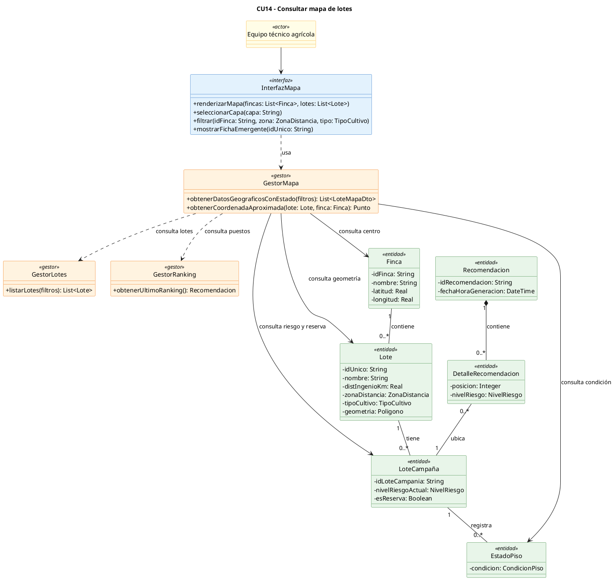
```plantuml
@startuml
title CU14 – Consultar mapa de lotes
skinparam classAttributeIconSize 0
skinparam shadowing false
hide circle
skinparam class {
  BackgroundColor<<interfaz>> #E3F2FD
  BorderColor<<interfaz>> #1565C0
  BackgroundColor<<gestor>> #FFF3E0
  BorderColor<<gestor>> #EF6C00
  BackgroundColor<<entidad>> #E8F5E9
  BorderColor<<entidad>> #2E7D32
  BackgroundColor<<actor>> #FFFDE7
  BorderColor<<actor>> #F9A825
}

class "Equipo técnico agrícola" as ET <<actor>>

class InterfazMapa <<interfaz>> {
  +renderizarMapa(fincas: List<Finca>, lotes: List<Lote>)
  +seleccionarCapa(capa: String)
  +filtrar(idFinca: String, zona: ZonaDistancia, tipo: TipoCultivo)
  +mostrarFichaEmergente(idUnico: String)
}

class GestorMapa <<gestor>> {
  +obtenerDatosGeograficosConEstado(filtros): List<LoteMapaDto>
  +obtenerCoordenadaAproximada(lote: Lote, finca: Finca): Punto
}

class GestorLotes <<gestor>> {
  +listarLotes(filtros): List<Lote>
}

class GestorRanking <<gestor>> {
  +obtenerUltimoRanking(): Recomendacion
}

class Finca <<entidad>> {
  -idFinca: String
  -nombre: String
  -latitud: Real
  -longitud: Real
}

class Lote <<entidad>> {
  -idUnico: String
  -nombre: String
  -distIngenioKm: Real
  -zonaDistancia: ZonaDistancia
  -tipoCultivo: TipoCultivo
  -geometria: Poligono
}

class "LoteCampaña" as LoteCampania <<entidad>> {
  -idLoteCampania: String
  -nivelRiesgoActual: NivelRiesgo
  -esReserva: Boolean
}

class EstadoPiso <<entidad>> {
  -condicion: CondicionPiso
}

class Recomendacion <<entidad>> {
  -idRecomendacion: String
  -fechaHoraGeneracion: DateTime
}

class DetalleRecomendacion <<entidad>> {
  -posicion: Integer
  -nivelRiesgo: NivelRiesgo
}

ET --> InterfazMapa
InterfazMapa ..> GestorMapa : usa
GestorMapa ..> GestorLotes : consulta lotes
GestorMapa ..> GestorRanking : consulta puestos
GestorMapa --> Finca : consulta centro
GestorMapa --> Lote : consulta geometría
GestorMapa --> LoteCampania : consulta riesgo y reserva
GestorMapa --> EstadoPiso : consulta condición

Finca "1" -- "0..*" Lote : contiene
Lote "1" -- "0..*" LoteCampania : tiene
LoteCampania "1" -- "0..*" EstadoPiso : registra
Recomendacion "1" *-- "0..*" DetalleRecomendacion : contiene
DetalleRecomendacion "0..*" -- "1" LoteCampania : ubica
@enduml
```

---

## CU15 – Activar prioridad orgánica

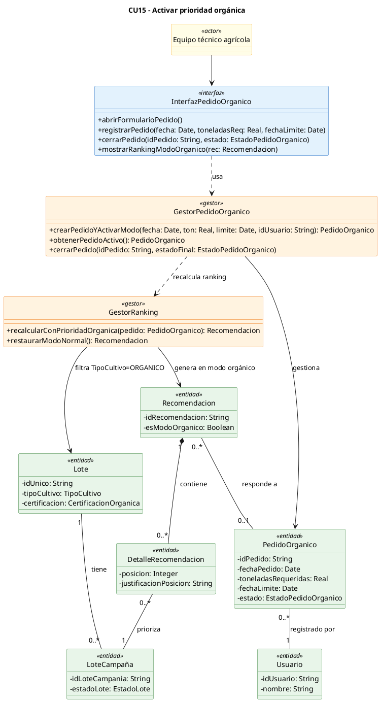
```plantuml
@startuml
title CU15 – Activar prioridad orgánica
skinparam classAttributeIconSize 0
skinparam shadowing false
hide circle
skinparam class {
  BackgroundColor<<interfaz>> #E3F2FD
  BorderColor<<interfaz>> #1565C0
  BackgroundColor<<gestor>> #FFF3E0
  BorderColor<<gestor>> #EF6C00
  BackgroundColor<<entidad>> #E8F5E9
  BorderColor<<entidad>> #2E7D32
  BackgroundColor<<actor>> #FFFDE7
  BorderColor<<actor>> #F9A825
}

class "Equipo técnico agrícola" as ET <<actor>>

class InterfazPedidoOrganico <<interfaz>> {
  +abrirFormularioPedido()
  +registrarPedido(fecha: Date, toneladasReq: Real, fechaLimite: Date)
  +cerrarPedido(idPedido: String, estado: EstadoPedidoOrganico)
  +mostrarRankingModoOrganico(rec: Recomendacion)
}

class GestorPedidoOrganico <<gestor>> {
  +crearPedidoYActivarModo(fecha: Date, ton: Real, limite: Date, idUsuario: String): PedidoOrganico
  +obtenerPedidoActivo(): PedidoOrganico
  +cerrarPedido(idPedido: String, estadoFinal: EstadoPedidoOrganico)
}

class GestorRanking <<gestor>> {
  +recalcularConPrioridadOrganica(pedido: PedidoOrganico): Recomendacion
  +restaurarModoNormal(): Recomendacion
}

class PedidoOrganico <<entidad>> {
  -idPedido: String
  -fechaPedido: Date
  -toneladasRequeridas: Real
  -fechaLimite: Date
  -estado: EstadoPedidoOrganico
}

class Lote <<entidad>> {
  -idUnico: String
  -tipoCultivo: TipoCultivo
  -certificacion: CertificacionOrganica
}

class "LoteCampaña" as LoteCampania <<entidad>> {
  -idLoteCampania: String
  -estadoLote: EstadoLote
}

class Recomendacion <<entidad>> {
  -idRecomendacion: String
  -esModoOrganico: Boolean
}

class DetalleRecomendacion <<entidad>> {
  -posicion: Integer
  -justificacionPosicion: String
}

class Usuario <<entidad>> {
  -idUsuario: String
  -nombre: String
}

ET --> InterfazPedidoOrganico
InterfazPedidoOrganico ..> GestorPedidoOrganico : usa
GestorPedidoOrganico ..> GestorRanking : recalcula ranking
GestorPedidoOrganico --> PedidoOrganico : gestiona
GestorRanking --> Recomendacion : genera en modo orgánico
GestorRanking --> Lote : filtra TipoCultivo=ORGANICO

PedidoOrganico "0..*" -- "1" Usuario : registrado por
Recomendacion "0..*" -- "0..1" PedidoOrganico : responde a
Recomendacion "1" *-- "0..*" DetalleRecomendacion : contiene
DetalleRecomendacion "0..*" -- "1" LoteCampania : prioriza
Lote "1" -- "0..*" LoteCampania : tiene
@enduml
```

---

## CU16 – Registrar cosecha realizada

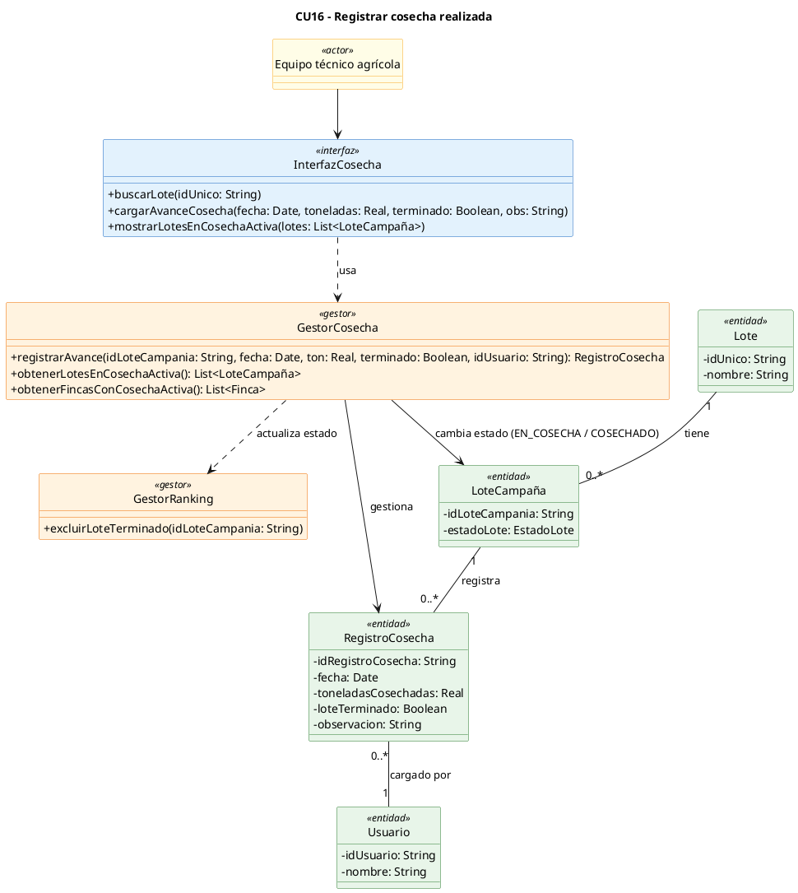
```plantuml
@startuml
title CU16 – Registrar cosecha realizada
skinparam classAttributeIconSize 0
skinparam shadowing false
hide circle
skinparam class {
  BackgroundColor<<interfaz>> #E3F2FD
  BorderColor<<interfaz>> #1565C0
  BackgroundColor<<gestor>> #FFF3E0
  BorderColor<<gestor>> #EF6C00
  BackgroundColor<<entidad>> #E8F5E9
  BorderColor<<entidad>> #2E7D32
  BackgroundColor<<actor>> #FFFDE7
  BorderColor<<actor>> #F9A825
}

class "Equipo técnico agrícola" as ET <<actor>>

class InterfazCosecha <<interfaz>> {
  +buscarLote(idUnico: String)
  +cargarAvanceCosecha(fecha: Date, toneladas: Real, terminado: Boolean, obs: String)
  +mostrarLotesEnCosechaActiva(lotes: List<LoteCampaña>)
}

class GestorCosecha <<gestor>> {
  +registrarAvance(idLoteCampania: String, fecha: Date, ton: Real, terminado: Boolean, idUsuario: String): RegistroCosecha
  +obtenerLotesEnCosechaActiva(): List<LoteCampaña>
  +obtenerFincasConCosechaActiva(): List<Finca>
}

class GestorRanking <<gestor>> {
  +excluirLoteTerminado(idLoteCampania: String)
}

class Lote <<entidad>> {
  -idUnico: String
  -nombre: String
}

class "LoteCampaña" as LoteCampania <<entidad>> {
  -idLoteCampania: String
  -estadoLote: EstadoLote
}

class RegistroCosecha <<entidad>> {
  -idRegistroCosecha: String
  -fecha: Date
  -toneladasCosechadas: Real
  -loteTerminado: Boolean
  -observacion: String
}

class Usuario <<entidad>> {
  -idUsuario: String
  -nombre: String
}

ET --> InterfazCosecha
InterfazCosecha ..> GestorCosecha : usa
GestorCosecha ..> GestorRanking : actualiza estado
GestorCosecha --> RegistroCosecha : gestiona
GestorCosecha --> LoteCampania : cambia estado (EN_COSECHA / COSECHADO)
Lote "1" -- "0..*" LoteCampania : tiene
LoteCampania "1" -- "0..*" RegistroCosecha : registra
RegistroCosecha "0..*" -- "1" Usuario : cargado por
@enduml
```

---

## CU17 – Registrar carros en patio

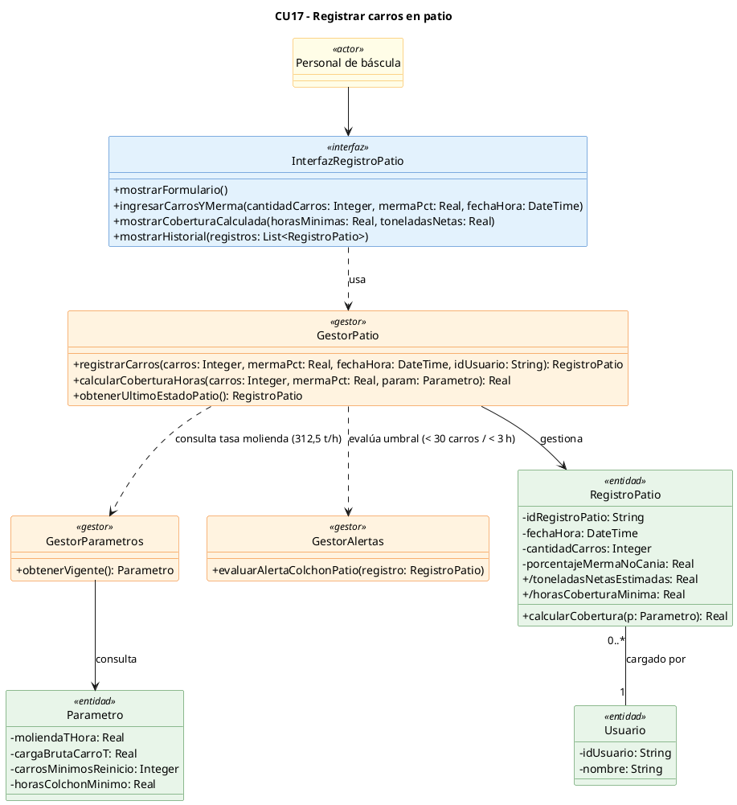
```plantuml
@startuml
title CU17 – Registrar carros en patio
skinparam classAttributeIconSize 0
skinparam shadowing false
hide circle
skinparam class {
  BackgroundColor<<interfaz>> #E3F2FD
  BorderColor<<interfaz>> #1565C0
  BackgroundColor<<gestor>> #FFF3E0
  BorderColor<<gestor>> #EF6C00
  BackgroundColor<<entidad>> #E8F5E9
  BorderColor<<entidad>> #2E7D32
  BackgroundColor<<actor>> #FFFDE7
  BorderColor<<actor>> #F9A825
}

class "Personal de báscula" as BAS <<actor>>

class InterfazRegistroPatio <<interfaz>> {
  +mostrarFormulario()
  +ingresarCarrosYMerma(cantidadCarros: Integer, mermaPct: Real, fechaHora: DateTime)
  +mostrarCoberturaCalculada(horasMinimas: Real, toneladasNetas: Real)
  +mostrarHistorial(registros: List<RegistroPatio>)
}

class GestorPatio <<gestor>> {
  +registrarCarros(carros: Integer, mermaPct: Real, fechaHora: DateTime, idUsuario: String): RegistroPatio
  +calcularCoberturaHoras(carros: Integer, mermaPct: Real, param: Parametro): Real
  +obtenerUltimoEstadoPatio(): RegistroPatio
}

class GestorParametros <<gestor>> {
  +obtenerVigente(): Parametro
}

class GestorAlertas <<gestor>> {
  +evaluarAlertaColchonPatio(registro: RegistroPatio)
}

class RegistroPatio <<entidad>> {
  -idRegistroPatio: String
  -fechaHora: DateTime
  -cantidadCarros: Integer
  -porcentajeMermaNoCania: Real
  +/toneladasNetasEstimadas: Real
  +/horasCoberturaMinima: Real
  +calcularCobertura(p: Parametro): Real
}

class Parametro <<entidad>> {
  -moliendaTHora: Real
  -cargaBrutaCarroT: Real
  -carrosMinimosReinicio: Integer
  -horasColchonMinimo: Real
}

class Usuario <<entidad>> {
  -idUsuario: String
  -nombre: String
}

BAS --> InterfazRegistroPatio
InterfazRegistroPatio ..> GestorPatio : usa
GestorPatio ..> GestorParametros : consulta tasa molienda (312,5 t/h)
GestorPatio ..> GestorAlertas : evalúa umbral (< 30 carros / < 3 h)
GestorPatio --> RegistroPatio : gestiona
GestorParametros --> Parametro : consulta
RegistroPatio "0..*" -- "1" Usuario : cargado por
@enduml
```

---

## CU18 – Emitir alerta temprana a Fábrica

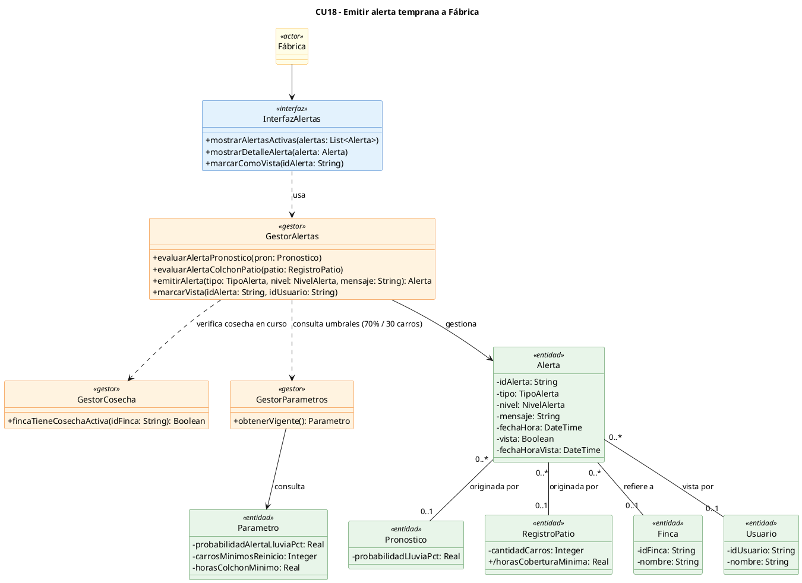
```plantuml
@startuml
title CU18 – Emitir alerta temprana a Fábrica
skinparam classAttributeIconSize 0
skinparam shadowing false
hide circle
skinparam class {
  BackgroundColor<<interfaz>> #E3F2FD
  BorderColor<<interfaz>> #1565C0
  BackgroundColor<<gestor>> #FFF3E0
  BorderColor<<gestor>> #EF6C00
  BackgroundColor<<entidad>> #E8F5E9
  BorderColor<<entidad>> #2E7D32
  BackgroundColor<<actor>> #FFFDE7
  BorderColor<<actor>> #F9A825
}

class "Fábrica" as FAB <<actor>>

class InterfazAlertas <<interfaz>> {
  +mostrarAlertasActivas(alertas: List<Alerta>)
  +mostrarDetalleAlerta(alerta: Alerta)
  +marcarComoVista(idAlerta: String)
}

class GestorAlertas <<gestor>> {
  +evaluarAlertaPronostico(pron: Pronostico)
  +evaluarAlertaColchonPatio(patio: RegistroPatio)
  +emitirAlerta(tipo: TipoAlerta, nivel: NivelAlerta, mensaje: String): Alerta
  +marcarVista(idAlerta: String, idUsuario: String)
}

class GestorCosecha <<gestor>> {
  +fincaTieneCosechaActiva(idFinca: String): Boolean
}

class GestorParametros <<gestor>> {
  +obtenerVigente(): Parametro
}

class Alerta <<entidad>> {
  -idAlerta: String
  -tipo: TipoAlerta
  -nivel: NivelAlerta
  -mensaje: String
  -fechaHora: DateTime
  -vista: Boolean
  -fechaHoraVista: DateTime
}

class Pronostico <<entidad>> {
  -probabilidadLluviaPct: Real
}

class RegistroPatio <<entidad>> {
  -cantidadCarros: Integer
  +/horasCoberturaMinima: Real
}

class Finca <<entidad>> {
  -idFinca: String
  -nombre: String
}

class Parametro <<entidad>> {
  -probabilidadAlertaLluviaPct: Real
  -carrosMinimosReinicio: Integer
  -horasColchonMinimo: Real
}

class Usuario <<entidad>> {
  -idUsuario: String
  -nombre: String
}

FAB --> InterfazAlertas
InterfazAlertas ..> GestorAlertas : usa
GestorAlertas ..> GestorCosecha : verifica cosecha en curso
GestorAlertas ..> GestorParametros : consulta umbrales (70% / 30 carros)
GestorAlertas --> Alerta : gestiona
GestorParametros --> Parametro : consulta

Alerta "0..*" -- "0..1" Finca : refiere a
Alerta "0..*" -- "0..1" Pronostico : originada por
Alerta "0..*" -- "0..1" RegistroPatio : originada por
Alerta "0..*" -- "0..1" Usuario : vista por
@enduml
```

---

## CU19 – Registrar parada de fábrica

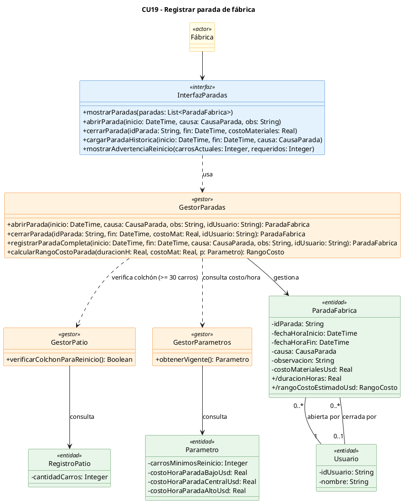
```plantuml
@startuml
title CU19 – Registrar parada de fábrica
skinparam classAttributeIconSize 0
skinparam shadowing false
hide circle
skinparam class {
  BackgroundColor<<interfaz>> #E3F2FD
  BorderColor<<interfaz>> #1565C0
  BackgroundColor<<gestor>> #FFF3E0
  BorderColor<<gestor>> #EF6C00
  BackgroundColor<<entidad>> #E8F5E9
  BorderColor<<entidad>> #2E7D32
  BackgroundColor<<actor>> #FFFDE7
  BorderColor<<actor>> #F9A825
}

class "Fábrica" as FAB <<actor>>

class InterfazParadas <<interfaz>> {
  +mostrarParadas(paradas: List<ParadaFabrica>)
  +abrirParada(inicio: DateTime, causa: CausaParada, obs: String)
  +cerrarParada(idParada: String, fin: DateTime, costoMateriales: Real)
  +cargarParadaHistorica(inicio: DateTime, fin: DateTime, causa: CausaParada)
  +mostrarAdvertenciaReinicio(carrosActuales: Integer, requeridos: Integer)
}

class GestorParadas <<gestor>> {
  +abrirParada(inicio: DateTime, causa: CausaParada, obs: String, idUsuario: String): ParadaFabrica
  +cerrarParada(idParada: String, fin: DateTime, costoMat: Real, idUsuario: String): ParadaFabrica
  +registrarParadaCompleta(inicio: DateTime, fin: DateTime, causa: CausaParada, obs: String, idUsuario: String): ParadaFabrica
  +calcularRangoCostoParada(duracionH: Real, costoMat: Real, p: Parametro): RangoCosto
}

class GestorPatio <<gestor>> {
  +verificarColchonParaReinicio(): Boolean
}

class GestorParametros <<gestor>> {
  +obtenerVigente(): Parametro
}

class ParadaFabrica <<entidad>> {
  -idParada: String
  -fechaHoraInicio: DateTime
  -fechaHoraFin: DateTime
  -causa: CausaParada
  -observacion: String
  -costoMaterialesUsd: Real
  +/duracionHoras: Real
  +/rangoCostoEstimadoUsd: RangoCosto
}

class RegistroPatio <<entidad>> {
  -cantidadCarros: Integer
}

class Parametro <<entidad>> {
  -carrosMinimosReinicio: Integer
  -costoHoraParadaBajoUsd: Real
  -costoHoraParadaCentralUsd: Real
  -costoHoraParadaAltoUsd: Real
}

class Usuario <<entidad>> {
  -idUsuario: String
  -nombre: String
}

FAB --> InterfazParadas
InterfazParadas ..> GestorParadas : usa
GestorParadas ..> GestorPatio : verifica colchón (>= 30 carros)
GestorParadas ..> GestorParametros : consulta costo/hora
GestorParadas --> ParadaFabrica : gestiona
GestorPatio --> RegistroPatio : consulta
GestorParametros --> Parametro : consulta

ParadaFabrica "0..*" -- "1" Usuario : abierta por
ParadaFabrica "0..*" -- "0..1" Usuario : cerrada por
@enduml
```

---

## CU20 – Generar informes

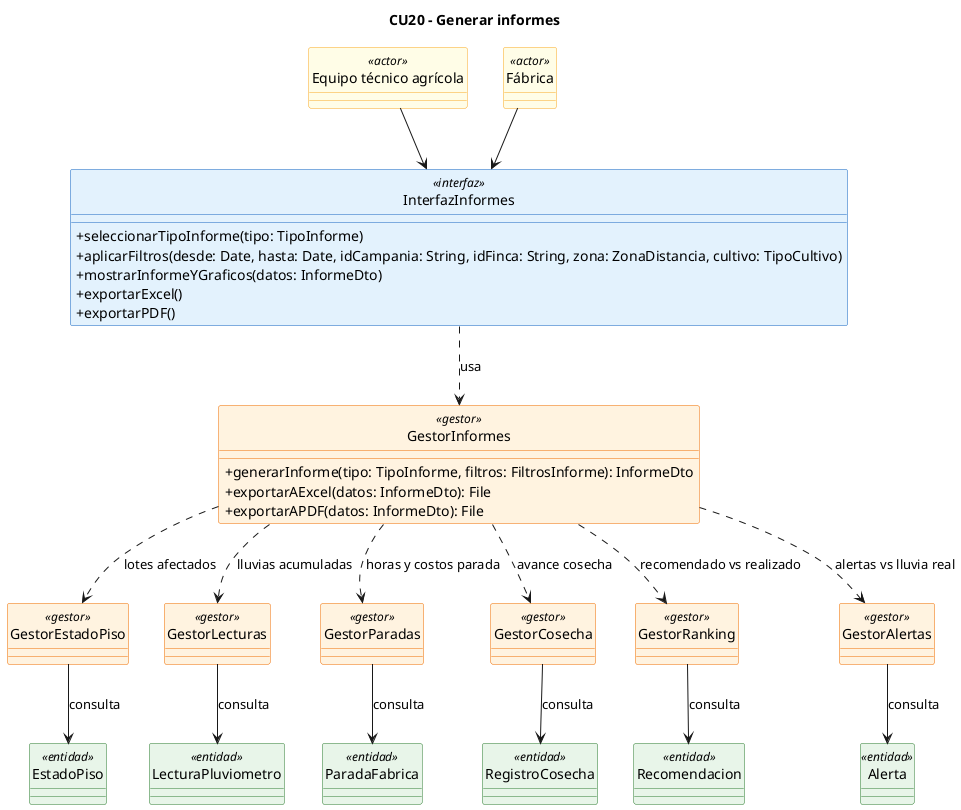
```plantuml
@startuml
title CU20 – Generar informes
skinparam classAttributeIconSize 0
skinparam shadowing false
hide circle
skinparam class {
  BackgroundColor<<interfaz>> #E3F2FD
  BorderColor<<interfaz>> #1565C0
  BackgroundColor<<gestor>> #FFF3E0
  BorderColor<<gestor>> #EF6C00
  BackgroundColor<<entidad>> #E8F5E9
  BorderColor<<entidad>> #2E7D32
  BackgroundColor<<actor>> #FFFDE7
  BorderColor<<actor>> #F9A825
}

class "Equipo técnico agrícola" as ET <<actor>>
class "Fábrica" as FAB <<actor>>

class InterfazInformes <<interfaz>> {
  +seleccionarTipoInforme(tipo: TipoInforme)
  +aplicarFiltros(desde: Date, hasta: Date, idCampania: String, idFinca: String, zona: ZonaDistancia, cultivo: TipoCultivo)
  +mostrarInformeYGraficos(datos: InformeDto)
  +exportarExcel()
  +exportarPDF()
}

class GestorInformes <<gestor>> {
  +generarInforme(tipo: TipoInforme, filtros: FiltrosInforme): InformeDto
  +exportarAExcel(datos: InformeDto): File
  +exportarAPDF(datos: InformeDto): File
}

class GestorEstadoPiso <<gestor>>
class GestorLecturas <<gestor>>
class GestorParadas <<gestor>>
class GestorCosecha <<gestor>>
class GestorRanking <<gestor>>
class GestorAlertas <<gestor>>

class EstadoPiso <<entidad>>
class LecturaPluviometro <<entidad>>
class ParadaFabrica <<entidad>>
class RegistroCosecha <<entidad>>
class Recomendacion <<entidad>>
class Alerta <<entidad>>

ET --> InterfazInformes
FAB --> InterfazInformes
InterfazInformes ..> GestorInformes : usa

GestorInformes ..> GestorEstadoPiso : lotes afectados
GestorInformes ..> GestorLecturas : lluvias acumuladas
GestorInformes ..> GestorParadas : horas y costos parada
GestorInformes ..> GestorCosecha : avance cosecha
GestorInformes ..> GestorRanking : recomendado vs realizado
GestorInformes ..> GestorAlertas : alertas vs lluvia real

GestorEstadoPiso --> EstadoPiso : consulta
GestorLecturas --> LecturaPluviometro : consulta
GestorParadas --> ParadaFabrica : consulta
GestorCosecha --> RegistroCosecha : consulta
GestorRanking --> Recomendacion : consulta
GestorAlertas --> Alerta : consulta
@enduml
```

---

## CU21 – Gestionar lotes de reserva

```plantuml
@startuml
title CU21 – Gestionar lotes de reserva
skinparam classAttributeIconSize 0
skinparam shadowing false
hide circle
skinparam class {
  BackgroundColor<<interfaz>> #E3F2FD
  BorderColor<<interfaz>> #1565C0
  BackgroundColor<<gestor>> #FFF3E0
  BorderColor<<gestor>> #EF6C00
  BackgroundColor<<entidad>> #E8F5E9
  BorderColor<<entidad>> #2E7D32
  BackgroundColor<<actor>> #FFFDE7
  BorderColor<<actor>> #F9A825
}

class "Equipo técnico agrícola" as ET <<actor>>

class InterfazLotesReserva <<interfaz>> {
  +mostrarPropuestaReserva(lotes: List<LoteCampaña>, tonTotales: Real, horasCobertura: Real)
  +mostrarSugerenciaAdelantoMalDrenados(lotes: List<LoteCampaña>)
  +confirmarReserva(idsLotes: List<String>)
}

class GestorReserva <<gestor>> {
  +proponerLotesReserva(idCampania: String): List<LoteCampaña>
  +identificarMalDrenadosAAdelantar(idCampania: String): List<LoteCampaña>
  +calcularCoberturaReservaHoras(lotes: List<LoteCampaña>, param: Parametro): Real
  +actualizarReservaActiva(idsLotesCampania: List<String>)
}

class GestorRiesgo <<gestor>> {
  +calcularRiesgoLote(lc: LoteCampaña): NivelRiesgo
}

class GestorParametros <<gestor>> {
  +obtenerVigente(): Parametro
}

class Lote <<entidad>> {
  -idUnico: String
  -tipoDrenaje: TipoDrenaje
  -zonaDistancia: ZonaDistancia
  -areaNetaHa: Real
}

class "LoteCampaña" as LoteCampania <<entidad>> {
  -idLoteCampania: String
  -esReserva: Boolean
  -rindeEstimadoTHa: Real
  +/toneladasEstimadas: Real
}

class MedicionBrix <<entidad>> {
  -valorBrix: Real
  -habilitadoMadurez: Boolean
}

class EstadoPiso <<entidad>> {
  -condicion: CondicionPiso
}

class Pronostico <<entidad>> {
  -probabilidadLluviaPct: Real
}

class Parametro <<entidad>> {
  -brixMinimo: Real
  -moliendaTHora: Real
  -probabilidadAlertaLluviaPct: Real
}

ET --> InterfazLotesReserva
InterfazLotesReserva ..> GestorReserva : usa
GestorReserva ..> GestorRiesgo : incluye CU12
GestorReserva ..> GestorParametros : consulta molienda y Brix
GestorReserva --> LoteCampania : marca esReserva
GestorReserva --> Lote : filtra drenaje=BIEN_DRENADO
GestorReserva --> MedicionBrix : verifica madurez
GestorReserva --> EstadoPiso : verifica HABILITADO
GestorReserva --> Pronostico : revisa alerta >= 70%

Lote "1" -- "0..*" LoteCampania : tiene
LoteCampania "1" -- "0..*" MedicionBrix : mide
LoteCampania "1" -- "0..*" EstadoPiso : registra
@enduml
```

---

## CU22 – Monitorear abastecimiento de patio

```plantuml
@startuml
title CU22 – Monitorear abastecimiento de patio
skinparam classAttributeIconSize 0
skinparam shadowing false
hide circle
skinparam class {
  BackgroundColor<<interfaz>> #E3F2FD
  BorderColor<<interfaz>> #1565C0
  BackgroundColor<<gestor>> #FFF3E0
  BorderColor<<gestor>> #EF6C00
  BackgroundColor<<entidad>> #E8F5E9
  BorderColor<<entidad>> #2E7D32
  BackgroundColor<<actor>> #FFFDE7
  BorderColor<<actor>> #F9A825
}

class "Equipo técnico agrícola" as ET <<actor>>
class "Fábrica" as FAB <<actor>>

class InterfazMonitorPatio <<interfaz>> {
  +mostrarTableroAbastecimiento(resumen: ResumenPatioDto)
  +mostrarProgresoReinicio(carrosActuales: Integer, objetivoCarros: Integer)
  +mostrarDistanciaMediaEnCosecha(kmPromedio: Real, advertenciaVelocidad: Boolean)
}

class GestorPatio <<gestor>> {
  +obtenerResumenAbastecimiento(): ResumenPatioDto
  +calcularCarrosFaltantesReinicio(actuales: Integer, objetivo: Integer): Integer
}

class GestorCosecha <<gestor>> {
  +obtenerLotesEnCosechaActiva(): List<LoteCampaña>
}

class GestorParadas <<gestor>> {
  +obtenerParadaAbierta(): ParadaFabrica
}

class GestorParametros <<gestor>> {
  +obtenerVigente(): Parametro
}

class GestorAlertas <<gestor>> {
  +evaluarAlertaColchonPatio(patio: RegistroPatio)
}

class RegistroPatio <<entidad>> {
  -fechaHora: DateTime
  -cantidadCarros: Integer
  -porcentajeMermaNoCania: Real
  +/horasCoberturaMinima: Real
}

class ParadaFabrica <<entidad>> {
  -fechaHoraInicio: DateTime
  -causa: CausaParada
}

class "LoteCampaña" as LoteCampania <<entidad>> {
  -idLoteCampania: String
  -estadoLote: EstadoLote
}

class Lote <<entidad>> {
  -distIngenioKm: Real
  -zonaDistancia: ZonaDistancia
}

class Parametro <<entidad>> {
  -moliendaTHora: Real
  -carrosMinimosReinicio: Integer
  -horasColchonMinimo: Real
}

class Alerta <<entidad>> {
  -tipo: TipoAlerta
  -mensaje: String
}

ET --> InterfazMonitorPatio
FAB --> InterfazMonitorPatio
InterfazMonitorPatio ..> GestorPatio : usa
GestorPatio ..> GestorCosecha : consulta frentes en corte
GestorPatio ..> GestorParadas : verifica parada abierta
GestorPatio ..> GestorParametros : consulta umbrales (30 carros / 312,5 t/h)
GestorPatio ..> GestorAlertas : extiende CU18 si bajo umbral

GestorPatio --> RegistroPatio : consulta último
GestorCosecha --> LoteCampania : filtra EN_COSECHA
GestorCosecha --> Lote : lee distancia ILE
GestorParadas --> ParadaFabrica : consulta
GestorAlertas --> Alerta : emite
@enduml
```

---

## CU23 – Simular escenarios

```plantuml
@startuml
title CU23 – Simular escenarios
skinparam classAttributeIconSize 0
skinparam shadowing false
hide circle
skinparam class {
  BackgroundColor<<interfaz>> #E3F2FD
  BorderColor<<interfaz>> #1565C0
  BackgroundColor<<gestor>> #FFF3E0
  BorderColor<<gestor>> #EF6C00
  BackgroundColor<<entidad>> #E8F5E9
  BorderColor<<entidad>> #2E7D32
  BackgroundColor<<actor>> #FFFDE7
  BorderColor<<actor>> #F9A825
}

class "Equipo técnico agrícola" as ET <<actor>>

class InterfazSimulador <<interfaz>> {
  +activarModoSimulacion()
  +ajustarLluviaSimulada(idFinca: String, mmSimulados: Real)
  +ajustarMermaPatio(mermaPct: Real)
  +alternarPedidoOrganicoSimulado(activo: Boolean, toneladas: Real)
  +mostrarComparativaOficialVsSimulado(oficial: Recomendacion, simulado: Recomendacion)
  +restablecerDatosReales()
}

class GestorSimulador <<gestor>> {
  +ejecutarSimulacion(escenario: EscenarioSimuladoDto): ResultadoSimulacionDto
  +descartarSimulacion()
}

class GestorRiesgo <<gestor>> {
  +simularRiesgoLote(lc: LoteCampaña, lluviaMmSimulada: Real): NivelRiesgo
}

class GestorRanking <<gestor>> {
  +generarRanking(idCampania: String, idUsuario: String, esSimulacion: Boolean): Recomendacion
}

class GestorReserva <<gestor>> {
  +simularActivacionReserva(escenario: EscenarioSimuladoDto): List<LoteCampaña>
}

class "LoteCampaña" as LoteCampania <<entidad>> {
  -idLoteCampania: String
}

class LecturaPluviometro <<entidad>> {
  -milimetros: Real
}

class PedidoOrganico <<entidad>> {
  -toneladasRequeridas: Real
}

class RegistroPatio <<entidad>> {
  -cantidadCarros: Integer
  -porcentajeMermaNoCania: Real
}

class Recomendacion <<entidad>> {
  -esSimulacion: Boolean
  -esModoOrganico: Boolean
}

class DetalleRecomendacion <<entidad>> {
  -posicion: Integer
  -nivelRiesgo: NivelRiesgo
}

note bottom of Recomendacion
  En CU23 las instancias de Recomendacion y
  DetalleRecomendacion son transitorias en memoria
  (esSimulacion = true) y nunca se persisten.
end note

ET --> InterfazSimulador
InterfazSimulador ..> GestorSimulador : usa
GestorSimulador ..> GestorRiesgo : recalcula riesgo en memoria
GestorSimulador ..> GestorRanking : incluye CU13 (esSimulacion=true)
GestorSimulador ..> GestorReserva : evalúa reserva necesaria

GestorSimulador --> LoteCampania : lee estado base
GestorSimulador --> LecturaPluviometro : lee lluvia base
GestorSimulador --> PedidoOrganico : simula pedido
GestorSimulador --> RegistroPatio : simula merma
GestorRanking --> Recomendacion : crea transitoria
Recomendacion "1" *-- "0..*" DetalleRecomendacion : contiene
@enduml
```
